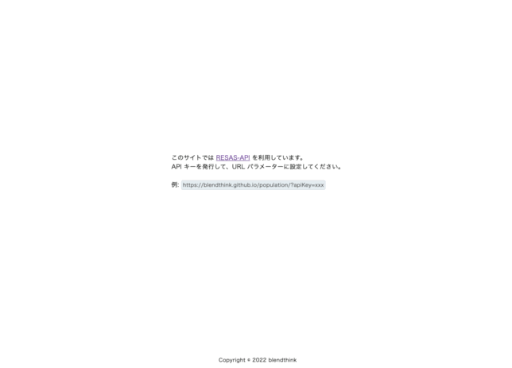

## 概要

都道府県の総人口推移をグラフ表示する Single Page Application

株式会社ゆめみの [フロントエンドコーディング試験](https://notion.yumemi.co.jp/0e9ef27b55704d7882aab55cc86c999d) を
Jetpack Compose for Web で取り組んでみたもの



## 利用しているもの

- [RESAS-API](https://opendata.resas-portal.go.jp/docs/api/v1/index.html)
- [ress](https://www.resset.dev/)
- [Highcharts](https://www.highcharts.com/)
- [Compose Multiplatform](https://www.jetbrains.com/ja-jp/lp/compose-mpp/)

## サイトの使い方

### 1. RESAS-API の API キーを発行する

API キーは [利用登録](https://opendata.resas-portal.go.jp/form.html) することで発行される

### 2. 取得した API キーを URL パラメーターに設定してページを読み込む

```
https://blendthink.github.io/population/?apiKey=xxx
```

## ローカル環境での動作確認

### 1. 開発環境を確認する

- macOS Monterey 12.3.1
- IntelliJ IDEA 2022.1.1 (Ultimate Edition)

### 2. IntelliJ IDEA にプラグインをインストールする

- Native Debugging Support: com.intellij.nativeDebug (221.5080.218)
- Kotlin/JS Inspection Pack: org.jetbrains.kotlin-js-inspection-pack-plugin (0.0.9)
- Jetpack Compose: androidx.compose.plugins.idea (221.5080.169)
- Kotlin: 221-1.6.20-release-285-IJ5080.210

### 3. Gradle タスクを実行してブラウザで確認する

IntelliJ IDEA の右の Gradle タブを開き、population → Tasks → kotlin browser → jsBrowserRun を実行して、ブラウザで確認する

```
http://localhost:8080/?apiKey=xxx

※ ポート番号は開発機の状況によって変化するため要注意
```

### 4. デバッグする

https://kotlinlang.org/docs/js-debugging.html
